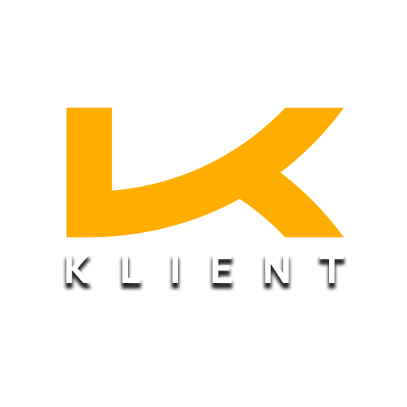

<p align="center">
  
</p>

<h1 align="center">Klient</h1>

<p align="center">
  <strong>Self-hosted Client Portal for Freelancers & Agencies</strong>
</p>

<p align="center">
  <a href="https://github.com/KORE-SYSTEMS/Klient/releases"></a>
  <a href="https://github.com/KORE-SYSTEMS/Klient/blob/main/LICENSE"></a>
  <a href="https://github.com/KORE-SYSTEMS/Klient/stargazers"></a>
  <a href="https://github.com/KORE-SYSTEMS/Klient/issues"></a>
  
</p>

---

**Klient** is a modern, self-hosted client portal built for freelancers and agencies. Manage projects, tasks, files, and client communication in one place -- fully under your control, no SaaS fees, no vendor lock-in.

## Features

- **Project Management** -- Status tracking, deadlines, and color-coded organization
- **Kanban Board** -- Drag-and-drop tasks across Backlog, Todo, In Progress, Review, Done
- **File Sharing** -- Upload files and control per-file client visibility
- **Project Chat** -- Real-time messaging within each project
- **Client Portal** -- Clients only see what you share, fully isolated access
- **Team & Roles** -- Admin, Member, and Client roles with granular permissions
- **Project Updates** -- Timeline with milestones, info, warnings, and requests
- **Version Check** -- See available updates directly in Settings
- **Single Container** -- One Docker container, SQLite database, zero external dependencies
- **Dark Theme** -- Clean UI built with shadcn/ui

## Tech Stack

| Layer | Technology |
|-------|-----------|
| Framework | Next.js 14 (App Router, Standalone) |
| Database | SQLite (via Prisma) |
| Auth | NextAuth.js v5 (JWT) |
| UI | shadcn/ui + Radix UI + Tailwind CSS |
| Language | TypeScript |
| Container | Docker (single container) |

---

## Quick Start

```bash
docker run -d \
  --name klient \
  -p 8399:3000 \
  -v klient-data:/app/data \
  -v klient-uploads:/app/uploads \
  -e NEXTAUTH_SECRET=$(openssl rand -base64 32) \
  -e NEXTAUTH_URL=http://localhost:8399 \
  -e DATABASE_URL=file:/app/data/klient.db \
  --restart unless-stopped \
  ghcr.io/kore-systems/klient:latest
```

Open **http://localhost:8399** and login:

| | |
|---|---|
| **Email** | `admin@klient.local` |
| **Password** | `changeme123` |

> **Change the admin password immediately after first login.**

---

## Installation

### Docker Compose (recommended)

```bash
# Clone the repository
git clone https://github.com/KORE-SYSTEMS/Klient.git
cd Klient

# Create environment file
cp .env.example .env

# Edit .env and set NEXTAUTH_SECRET
# Generate one with: openssl rand -base64 32
nano .env

# Start
docker compose up -d
```

That's it. Klient runs at **http://localhost:8399**.

### Unraid

#### Option 1: Community Apps (XML Template)

1. In the Unraid web UI, go to **Docker** > **Add Container**
2. Click **Template repositories** and add:
   ```
   https://github.com/KORE-SYSTEMS/Klient
   ```
3. Select **Klient** from the template list
4. Fill in:
   - **NEXTAUTH_SECRET** -- generate with `openssl rand -base64 32`
   - **NEXTAUTH_URL** -- `http://YOUR-UNRAID-IP:8399`
5. Click **Apply**

#### Option 2: Docker Compose on Unraid

```bash
# SSH into your Unraid server
mkdir -p /mnt/user/appdata/klient
cd /mnt/user/appdata/klient

# Clone
git clone https://github.com/KORE-SYSTEMS/Klient.git .

# Configure
cp .env.example .env
nano .env
# Set: NEXTAUTH_SECRET=your-generated-secret
# Set: NEXTAUTH_URL=http://YOUR-UNRAID-IP:8399

# Start
docker compose up -d
```

#### Option 3: Docker Run on Unraid

```bash
docker run -d \
  --name klient \
  -p 8399:3000 \
  -v /mnt/user/appdata/klient/data:/app/data \
  -v /mnt/user/appdata/klient/uploads:/app/uploads \
  -e NEXTAUTH_SECRET=your-generated-secret \
  -e NEXTAUTH_URL=http://YOUR-UNRAID-IP:8399 \
  -e DATABASE_URL=file:/app/data/klient.db \
  --restart unless-stopped \
  ghcr.io/kore-systems/klient:latest
```

### Any Linux Server / VPS

```bash
docker run -d \
  --name klient \
  -p 8399:3000 \
  -v /opt/klient/data:/app/data \
  -v /opt/klient/uploads:/app/uploads \
  -e NEXTAUTH_SECRET=$(openssl rand -base64 32) \
  -e NEXTAUTH_URL=http://YOUR-SERVER-IP:8399 \
  -e DATABASE_URL=file:/app/data/klient.db \
  --restart unless-stopped \
  ghcr.io/kore-systems/klient:latest
```

---

## Reverse Proxy

### Nginx Proxy Manager

1. Add a new **Proxy Host**:
   - **Domain:** `klient.yourdomain.com`
   - **Scheme:** `http`
   - **Forward IP:** your server IP
   - **Forward Port:** `8399`
2. Enable **SSL** via Let's Encrypt
3. Update the container's `NEXTAUTH_URL` to `https://klient.yourdomain.com`

### Traefik / Caddy

Point your reverse proxy to `http://localhost:8399` and set `NEXTAUTH_URL` to your public domain.

---

## Updates

### Docker Compose

```bash
cd /path/to/Klient
git pull
docker compose up -d --build
```

### Docker Run

```bash
docker pull ghcr.io/kore-systems/klient:latest
docker stop klient && docker rm klient
# Run the docker run command again (your data volumes persist)
```

### Watchtower (automatic)

If you use [Watchtower](https://containrrr.dev/watchtower/) on Unraid or your server, Klient will update automatically when a new image is published.

Klient also shows available updates in **Settings > Version & Updates**.

---

## Backups

### Database

The SQLite database is stored at `/app/data/klient.db` (mapped to your host volume).

```bash
# Simple file copy
cp /path/to/klient/data/klient.db backup_$(date +%Y%m%d).db
```

### Uploaded Files

```bash
cp -r /path/to/klient/uploads/ backup_uploads_$(date +%Y%m%d)/
```

### Unraid

Back up your `/mnt/user/appdata/klient/` directory -- it contains both the database and uploaded files.

---

## Configuration

| Variable | Required | Default | Description |
|----------|----------|---------|-------------|
| `NEXTAUTH_SECRET` | **Yes** | -- | Session encryption secret |
| `NEXTAUTH_URL` | **Yes** | `http://localhost:8399` | Public URL of your instance |
| `DATABASE_URL` | No | `file:/app/data/klient.db` | SQLite database path |
| `PORT` | No | `8399` | Host port (docker-compose only) |

---

## Development

```bash
# Prerequisites: Node.js 20+
npm install
cp .env.example .env

# Set DATABASE_URL for local dev
echo 'DATABASE_URL="file:./dev.db"' >> .env
echo 'NEXTAUTH_SECRET="dev-secret"' >> .env

npx prisma migrate dev
npm run db:seed
npm run dev
```

Dev server runs at **http://localhost:3000**.

---

## Project Structure

```
Klient/
├── app/                  # Next.js pages & API routes
│   ├── (auth)/           # Login, invitation
│   ├── (dashboard)/      # Dashboard, projects, clients, settings
│   └── api/              # REST API
├── components/           # UI components
├── lib/                  # Auth, Prisma, utilities
├── prisma/               # Schema, migrations, seed
├── public/               # Static assets
├── docker-compose.yml    # Single-container Docker stack
├── Dockerfile            # Multi-stage production build
├── klient.xml            # Unraid Docker template
└── docker-entrypoint.sh  # Startup (migrations + seed)
```

---

## Contributing

Contributions welcome! Open an [issue](https://github.com/KORE-SYSTEMS/Klient/issues) or submit a [pull request](https://github.com/KORE-SYSTEMS/Klient/pulls).

## License

[MIT License](LICENSE)

---

<p align="center">
  Built by <a href="https://github.com/KORE-SYSTEMS">KORE SYSTEMS</a>
</p>
